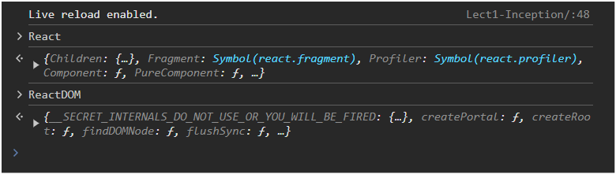

# 1. Inception 🌱

## Inception

- First, we started with normal HTML and then wrote `<h1>Namaste React</h1>` inside the root element.
- Then, Akshay showed us how to do the same thing with JavaScript. Below is the code to add `<h1>Namaste React</h1>` inside the root element.

```html
<script>
  const root = document.getElementById("root");
  const h1 = document.createElement("h1");
  h1.textContent = "Namaste React";
  root.appendChild(h1);
</script>
```

- Very easy, we all have worked with JS, and we know **DOM Manipulation**.
- We know the browser provides us with a DOM API to directly interact with HTML elements and make our websites dynamic.

## It's Time to add React to our code 🚀

But we aren't going to do `npm create react app` yet. Wait!

- In this lecture, we started with simple **React** and **React-DOM** using a CDN. This demonstrates what a library is all about—libraries are simple and lightweight.
- We can easily import them and start working with them.
- However, the same can't be done with frameworks. **Frameworks** impose certain rules and structures that we must follow.

### Key Points:

- **React** and **React-DOM** are libraries, which are typically more flexible and lightweight.
- **Frameworks** require adherence to specific conventions and provide a more structured environment.

To learn more about using React with a CDN, you can refer to the official [React CDN documentation](https://legacy.reactjs.org/docs/cdn-links.html).

Now add both the CDN links to the `index.html` file in the `<script>` tags at the end of the `<body>` tag to add React to your project.

```html
<body>
  <div id="root"></div>
  <script
    crossorigin
    src="[https://unpkg.com/react@18/umd/react.development.js](https://unpkg.com/react@18/umd/react.development.js)"
  ></script>
  <script
    crossorigin
    src="[https://unpkg.com/react-dom@18/umd/react-dom.development.js](https://unpkg.com/react-dom@18/umd/react-dom.development.js)"
  ></script>
</body>
```

As soon as we add these CDN links, we'll gain the superpower of React and ReactDOM. 💪

We can check this by opening the browser console and typing `React` and `ReactDOM`. Below is what we should see:



Now we will write React code to render `Namaste React` on our webpage.

Add the following script to your `index.html` file within the `<script>` tags, placed at the end of the `<body>` tag:

```html
<script>
  const heading = React.createElement("h1", {}, "Namaste React!!");
  const root = ReactDOM.createRoot(document.querySelector("#root"));
  root.render(heading);
</script>
```

Well, React is very intuitive to understand, but for reference, here is the explanation for each line of code:

1.  Creating a React Element

`const heading = React.createElement("h1", {}, "Namaste React!!");`

- This line creates a React element representing an `<h1>` HTML tag with the text "Namaste React!!". The `React.createElement` function is used to create elements that will be rendered (added into the HTML DOM) by the `React.render()` method.
- In the `React.createElement()` method, we have `{}`, an empty object. In this, we can pass props, like adding `id`, `class`, or `style` directly to the tag.

2. Selecting the Root Element

`const root = ReactDOM.createRoot(document.querySelector("#root"));`

- This line selects the DOM element with the ID "root" and prepares it as the root for React rendering. `ReactDOM.createRoot` initializes a React root that will manage the React tree.

3. Rendering the Element

`root.render(heading);`

- This line renders the `heading` React element into the `root` element. The `root.render` function injects the `heading` element into the DOM at the location of the `root` element. It will override the content of the `root` element.

### Key Points:

- **React** elements, at the end of the day, are **objects**. If we do `console.log(heading)` and `console.log(root)`, we will get objects in return.
- We can add **React** into our existing HTML project.
- So, suppose if we want to add React to a `SearchBar`, just make that element the `root`, and we can write React code for that. (But this is not recommended).
- We generally have one `root`, and we write all our React code inside that `root`, no matter how large the application is.

### Interesting Question 🤔 from Akshay Saini

What will happen if we add lots of other elements inside the `root` element where React is rendering?

Consider the following HTML:

```html
<body>
  <div id="root">
    <h1 id="title">Hello World</h1>
    <h1 id="title">Hello World</h1>
    <h1 id="title">Hello World</h1>
  </div>
</body>
```

In this case, what will happen to the heading rendered by React? Will it appear before or after all the existing tags?

- Well, the `react.render()` method overwrites everything inside the `root`.
- This approach in React ensures that the entire content of the root element is controlled by the content specified in the `ReactDOM.render()` call.

### Developer Community Practice 💻

In the developer community, it is common to place the text `Not Rendered` inside the root element to help identify issues with React rendering.

Consider the following HTML:

```html
<body>
  <div id="root">Not Rendered</div>
</body>
```

- If `Not rendered` is printed on the web page, that means there is some error with React rendering, and React is not able to modify the `root`.

- Since the `<script>` tags are placed at the end of the `<body>` tag, the browser first renders the HTML and displays `Not Rendered` before executing the React scripts.

- If everything is set up correctly, React will modify the contents of the root element after the page has loaded and the scripts have been executed.

- React's core philosophy was to write everything in JS files, leaving the HTML file as it is. But the older way, with creating `React.createElement()` and then `ReactDOM.createRoot()` and so on, was not suitable for big applications.
- It was very verbose and complicated to write this much code just for creating simple `h1` and `div` tags and then rendering them to HTML.

### So JSX was built 🎉

- The introduction of JSX (JavaScript XML) in 2013 was a significant step forward in making React development more intuitive and readable.
- JSX allows developers to write HTML-like syntax directly within JavaScript files.
- Under the hood, JSX files are translated into React's native way of writing code, and then that is again translated to normal HTML, CSS, and JS.
- Babel is the tool responsible for converting JSX code into native React code.
- It processes JSX syntax and transforms it into plain JavaScript that browsers can understand and execute.

### Here's a brief comparison of using `React.createElement()` versus JSX:

#### Using React.createElement():

`const element = React.createElement('h1', null, 'Hello, world!');`

#### Using JSX:

`const element = <h1>Hello, world!</h1>;`

- The JSX syntax is much cleaner and easier to understand because of its HTML-like structure.

Thanks to **JSX** for making our lives easier. 😎
