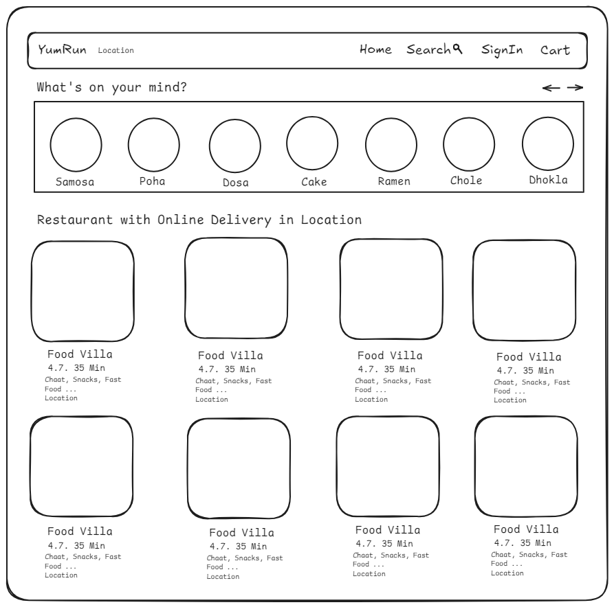

# 04. Talk is cheap Show me the Code

- Now its time to build something tangible. In all previous lectures Akshay emphasized on building the Foundation.
- Its time to take those knowledge and build something.
- Akshay decided to go with Food Ordering App aka Swiggy Clone.

## Before making any project

- Before making any web app we must have wireframe in mind.
- How will it look? And other planning. For example I created below wireframe for my app (inspired by Swiggy)
  
- After creating wireframe planning comes. We will plan regarding our project folder strucutre etc.

```bash
    Header
        - Logo
        - NavItems
         - Search
         - Cart
    Body
        - RestaurantList
         - RestaurantCard
           - Image
           - Name
           - Rating
           - Cuisines
    Footer
        - Links
        - Copyright
```

- Above example is just a outline for our app. But it could have much more complex strucutres.

Lets Talk about JSX

- We talk about JSX in last lecture as well but in this lecture something were discussed

## JSX Returns Only One Parent Element 🚨

- In JSX, you must return a **single parent element** or **component** from a function component or render method.

## Options:

### Wrap in a Single Element 📦

- We can use parent element like `<div>`, `<section>`, etc

```javascript
function MyComponent() {
  return (
    <div>
      <h1>Hello, World!</h1>
      <p>This is a paragraph.</p>
    </div>
  );
}
```

- But using parent element will add another node to our `root` element. To avoid this we can use below method.

### Use React Fragment 🧩

- To avoid extra DOM nodes, use `React.Fragment` or the shorthand <>...</>.
- `<React.Fragment></React.Fragment>` is a Function Componet of React.
- It acts like a parent container with adding anything to our DOM.

```javascript
function MyComponent() {
  return (
    <>
      <h1>Hello, World!</h1>
      <p>This is a paragraph.</p>
    </>
  );
}
```

### Why Only One Parent? 🤔

- JSX returns a single object representing the UI tree 🌳.
- JSX Ensures components are valid trees with one root node, essential for React rendering.

## Can We Use `React Fragments` Inside `React Fragments`? 🤔

- Answer is **yes!!** we can nest React Fragments within other React Fragments.

```javascript
function NestedFragments() {
  return (
    <>
      <h1>Title</h1>
      <>
        <p>Paragraph 1</p>
        <p>Paragraph 2</p>
      </>
      <>
        <ul>
          <li>Item 1</li>
          <li>Item 2</li>
        </ul>
      </>
    </>
  );
}
```

### Can We Use React Fragments Inside React Fragments? 🤔

- Yes! You can nest React Fragments within other React Fragments.

Example:

```javascript
function NestedFragments() {
  return (
    <>
      <h1>Title</h1>
      <>
        <p>Paragraph 1</p>
        <p>Paragraph 2</p>
      </>
      <>
        <ul>
          <li>Item 1</li>
          <li>Item 2</li>
        </ul>
      </>
    </>
  );
}
```

### Why Use Nested Fragments? 🤓

- It helps in logically organizing section without affecting the DOM strucutre 📦.
- It is also useful for rendering parts of the UI conditionally 🔄.

Here is example:-

```javascript
function UserProfile({ isLoggedIn, user }) {
  return (
    <>
      <h1>User Profile</h1>
      {isLoggedIn ? (
        <>
          <h2>Welcome, {user.name}!</h2>
          <>
            <p>Email: {user.email}</p>
            <p>Location: {user.location}</p>
          </>
        </>
      ) : (
        <>
          <h2>Please Log In</h2>
          <p>You need to log in to view your profile.</p>
        </>
      )}
    </>
  );
}

// Usage Example:
const user = { name: "John Doe", email: "john@example.com", location: "New York" };

// Logged In
<UserProfile isLoggedIn={true} user={user} />

// Not Logged In
<UserProfile isLoggedIn={false} user={user} />

```

### Note 📝

- Nested Fragments won't add extra elements to the DOM but will keep our JSX clean and organized!

## Config Driven UI 📦

- **Config Driven UI** is a design pattern where the structure and behavior of a user interface (UI) are determined by a configuration file or set of configuration data, rather than being hard-coded.
- We control our front using a config that is why it is known as config driven UI.
- Backend and API is configuring the UI based on certain parameters.
- **Swiggy:** Displays restaurant lists and offers based on the user's location. The UI adapts dynamically to show relevant data without hardcoding specific restaurants or offers.
- **YouTube:** Provides personalized video recommendations. Each user sees different content based on their preferences, location, and viewing history, driven by configuration rather than hardcoded lists.

### Key Point 📌

- **Config Driven UI** means the UI is not hardcoded. Instead, it is dynamically generated based on configuration data, making it flexible and adaptable to different users or scenarios.

## Props ⚛️

- Props (short for "properties") allow us to pass data from a parent component to a child component.
- Props are how components in React communicate with each other.
- Props are passed to a component as an object. This object contains all the properties (or "props") that we passed from parent component to the child compnent.
- We can pass multiple props.
- As Function Components are normal JavaScript Function so props are nothing but properties.

### Key Concepts 🧩

1. **Immutable:**

- Props are read-only. Once passed to a child component, they cannot be modified by that component.

2. **Data Flow:**

- Props enable unidirectional data flow from **parent** to **child**, which helps in maintaining a predictable and manageable application state.

3. **Functionality**

- Props can pass various types of data, including strings, numbers, arrays, objects, and functions.

#### Example 🚀

Here's a simple example to illustrate:

```javascript
// Parent Component
function UserProfile(props) {
  console.log(props); // Logs the props object

  return (
    <div>
      <h1>{props.name}</h1>
      <p>Age: {props.age}</p>
    </div>
  );
}

// Usage in a Parent Component
function App() {
  return <UserProfile name="Alice" age={28} />;
}
```

- When `UserProfile` is called in the `App`component, React bundles all the attributes (`name` and `age` in this case) into a single `props` object.
  This `props` object is passed to the UserProfile component, which can then access its properties using `props.name`, `props.age`, etc.

#### Destructuring Props ✂️

- To make our code cleaner, we can destructure props object directly in the function signature:

```jsx
function UserProfile({ name, age }) {
  return (
    <div>
      <h1>{name}</h1>
      <p>Age: {age}</p>
    </div>
  );
}
```

## Virtual DOM in React 🌐

- The Virtual DOM is a key concept in React that helps optimize the process of updating the user interface (UI) efficiently.
- It acts as an intermediary between the actual DOM (Document Object Model) and the React components, enabling faster updates and better performance.
- Virtual DOM is needed for `Reconcilliation.`

## Key Concepts 🧩

### What is the Virtual DOM?

- The Virtual DOM is a lightweight in-memory representation of the actual DOM.
- It is a JavaScript object that mirrors the structure of the real DOM but is not directly tied to it.

### How It Works:

- **Initial Render:** When a React component is rendered for the first time, React creates a Virtual DOM tree that mirrors the structure of the real DOM.
- **Updating:** When a component’s state or props change, React updates the Virtual DOM tree first, instead of directly manipulating the real DOM.
- **Reconciliation:** The algorithm React uses to `diff` one tree with another to determine which parts need to be changed.

  - In reconcilliation react compares the virtual dom with real dom using diff algorithm.

- **Efficient Updates:** Only the differences between the previous and current Virtual DOM are calculated.
  - React then efficiently updates only those parts of the real DOM that changed, rather than re-rendering the entire DOM.

### Benefits 🌟

- **Performance:** By minimizing direct manipulations of the real DOM, React significantly improves performance and responsiveness.
- **Efficiency:** The Virtual DOM allows React to batch and optimize updates, reducing the number of expensive DOM operations.

## Why Not Use Index as Key in React? 🚫

1. **Unstable Keys:**

- If the list changes (e.g., items are added, removed, or reordered), the index-based keys will also change, leading to potential mismatches between the Virtual DOM and the real DOM.
- This can cause React to incorrectly update or re-render items.

2. **Performance Degradation:**

- React uses keys to optimize the rendering process.
- When the index is used as the key, React might not efficiently identify which items have changed, resulting in unnecessary re-renders or performance degradation.

3. **State Management Issues:**

- If your components have internal state or animations, using index-based keys can cause issues where state or animations are not preserved correctly, leading to unexpected behavior.

4. **Ordering Problems:**

- When the list is reordered, using the index as the key might cause React to misidentify elements, leading to visual inconsistencies or incorrect item rendering.

**Example Problem**

```javascript
function ItemList({ items }) {
  return (
    <ul>
      {items.map((item, index) => (
        <li key={index}>{item.text}</li>
      ))}
    </ul>
  );
}
```

**Issue:** If you add an item to the list, all existing items will have their keys (indices) shift.

- React might then misinterpret which item has changed, leading to potential issues with item state or animation.

**Prefer Unique Identifiers**

- We should use unique and stable values for key to ensure React can efficiently manage and update lists.
