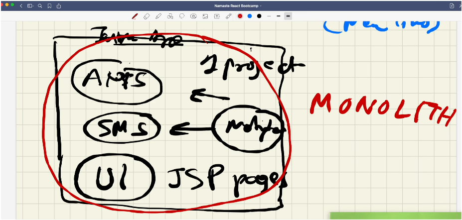
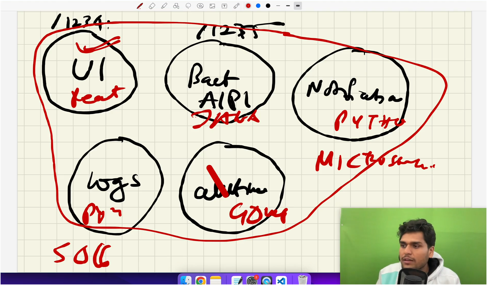

# 06. Exploring the World 🌍

- In this lecture our frontEnd which is a UI Microservice will be conncted with backend.
- We will explore the world.

In React:

- **State Changes 🔄**: When you create a state variable using `useState`, any change in state triggers a re-render of the component.
- **Component Re-rendering 🔁**: The entire component re-renders, but only the necessary parts of the DOM update.

- **Reconciliation 🔍**: React compares the new virtual DOM with the old one and updates only what's changed.

- **Performance Optimization 🚀**: Use `React.memo`, `useMemo`, or `useCallback` to avoid unnecessary re-renders and improve performance.

React ensures that your UI stays in sync with the state while being efficient and performant!

## Service Architectures

- Service architectures refer to the design and structure of how services are organized, deployed, and interact within a software system.
- Here are the overview of key service architechture:

### Monolith Architecture 🏢



- In monlith we have **Single Codebase** where all functionalites are bundled together in one large application.
- Components are interdependent; a change in one part can impact the whole system.
- Its easy to deploy but challenging to scale and maintain as application grows.

### MicroServices Architecture 🧩



- In **Microservices Architecture** 🧩, the whole application is divided into smaller, independent services, each handling a specific function.
- Each smaller service can run on a different port on the same domain. While these services can have different domains, they are generally accessed through the same domain with different slugs or routes.
- Each service can be written in a different language; for example, some UI components might be in React, others in Angular, and the backend could be in Node.js or Java.
- These services often interact via APIs, typically using HTTP/REST, gRPC, or message queues.

# For UI Exploring other Mircroservice or API is World 🌐

- In this session, we connected the UI with the Swiggy API.
- We can fetch data from other backends using promises and the `fetch()` API provided by the browser.
- We have two options for fetching an API:

  1. **Page Loads** ➡️ **API is called** (takes about 300ms) ➡️ **UI Renders** (takes about 200ms) ➡️ **Total: 500ms**
  2. **Page Loads** ➡️ **UI Renders** (100ms) ➡️ **API is called** ➡️ **UI is updated** (with API data) ➡️ **Total: 500ms**

- For the best and fastest user experience, the second approach is preferable. It renders the page first, so the user has something to interact with, and then fetches the API data in the background. Once the data is available, the UI is updated.

## The `useEffect()` Hook 🔄

- To achieve this, React provides a hook called `useEffect()`.
- `useEffect()` is used to handle side effects like fetching APIs, and other things.
- It requires two things: a **callback function** and a **dependency array**.
- If we don't use the dependency array, `useEffect()` will re-run every time the state or props change, which we usually want to avoid.
- By passing a dependency array to `useEffect()`:
  - An **empty array** `[]` will make `useEffect()` run only once, after the initial render.
  - After the API data comes the component rerenders again.
  - A dependency in the array will trigger `useEffect()` on the first render and whenever that dependency changes.
    - For example, if we pass a `btn` as a dependency, `useEffect()` will run on every button click.

## What is CORS? 🌐

**CORS (Cross-Origin Resource Sharing)** is a security feature implemented by web browsers to control how resources (like APIs) can be requested from a different domain (or origin) than the one from which the page was served.

### Why Do We Get CORS Issues? 🚫

- **Same-Origin Policy**: Browsers block requests made from one origin to a different origin by default. This is to prevent malicious websites from accessing sensitive data on another site.

### How CORS Works ⚙️

- **Preflight Requests**: Before making the actual API request, the browser sends an "OPTIONS" request to the server to check if the server allows the cross-origin request.
- **CORS Headers**: If the server allows the request, it responds with specific headers:

  - `Access-Control-Allow-Origin`: Specifies which origins are allowed.
  - `Access-Control-Allow-Methods`: Specifies allowed HTTP methods (GET, POST, etc.).
  - `Access-Control-Allow-Headers`: Specifies which headers can be used in the request.

- We can use a cors plugin that can help resolve this cors issue which fetching APIs.

## What is Optional Chaining? 🔗

**Optional chaining** (`?.`) is a feature in JavaScript that allows you to safely access deeply nested properties of an object without having to check if each reference in the chain is valid.

- If any part of the chain is `null` or `undefined`, the expression will short-circuit and return `undefined` instead of throwing an error.

### Why Use Optional Chaining? 🤔

When working with complex objects, you might need to access nested properties. Traditionally, you would have to manually check each level of the object to ensure it exists, like this:

```javascript
const user = {
  profile: {
    name: "John Doe",
  },
};
```

```javascript
// Traditional way
const userName = user && user.profile && user.profile.name;
// Returns 'John Doe'
```

- This approach can be cumbersome, especially when dealing with deeply nested objects. Optional chaining simplifies this by allowing you to write:

```javascript
const userName = user?.profile?.name;
// Returns 'John Doe' or 'undefined' if any property in the chain is null or undefined
```

### Key Benefits of Optional Chaining ✨

- **Safety:** Avoids runtime errors when accessing properties on `null` or `undefined`.
- **Readability:** Reduces the need for repetitive null checks, making the code cleaner and easier to understand.
- **Efficiency:** Short-circuits the evaluation of the expression as soon as a `null` or `undefined` is encountered.

## Shimmer UI ✨

- Suppose our API fetching takes some time to retrieve and populate data.
- What should we do in the meantime? What will we show to users?
- If we simply show a "loading..." screen, it won't provide a good user experience.
- Psychologists have found that showing users placeholders of the content that is yet to load is more effective.
- This approach doesn't strain the eyes, and users can anticipate that something will appear around these skeleton placeholders.
- This effect is known as the **Shimmer Effect**.
- We should display the shimmer effect for the content until it is fully loaded.
