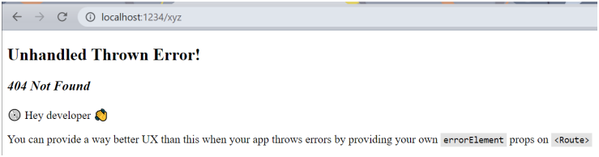
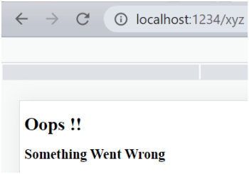
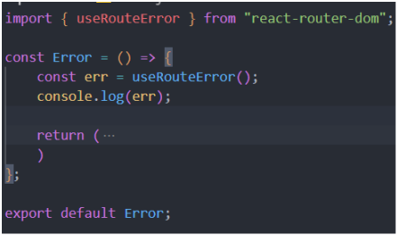
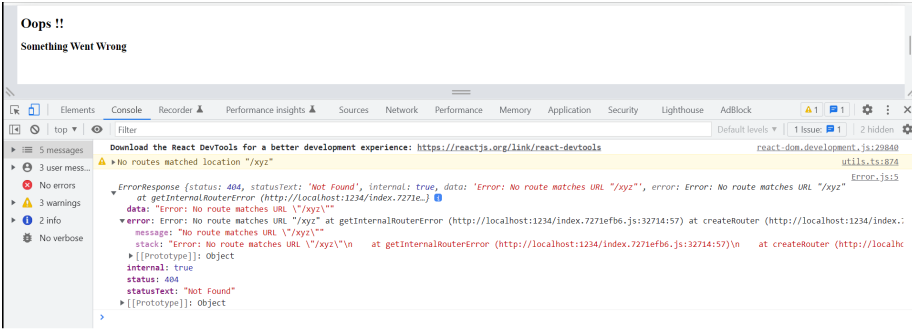
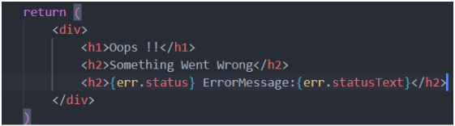

# 07. Finding the Path 🛤️

## Implementing Routing in React

- Routing in a React application allows you to navigate between different components or pages without refreshing the entire page.
- To implement routing, we use the `react-router-dom` library, which is maintained by the Remix team and provides powerful features for **client-side routing**.

1. Installing `react-roter-dom`

```bash
npm install react-router-dom
```

2. Setting Up Routing with `createBrowserRouter`

- To create a routing, we have to create a configuration for our router.
- We use `createBrowserRouter` for more explicit and flexible route management. 
- First import `createBrowserRouter` component from `react-router-dom`

Here’s how you can set it up:

```bash
import { createBrowserRouter, RouterProvider } from "react-router-dom";

const router = createBrowserRouter([
  {
    path: "/",
    element: <Home />,
  },
  {
    path: "/about",
    element: <About />,
  },
  {
    path: "/contact",
    element: <Contact />,
  },
]);

function App() {
  return (
    <RouterProvider router={router} />
  );
}

ReactDOM.render(<App />, document.getElementById('root'));

```

### Understanding the Code

- `createBrowserRouter:` This function creates a router instance with a route configuration. Each route is defined with a `path` and an `element` to render.
- `createBrowserRouter:` is a component which take an array of objects which contains routes info.
- `RouterProvider:` This component is used to supply the router configuration (`router`) to your application, enabling routing functionality.

3. Navigating Between Routes

- You can navigate between routes using the `Link` component from `react-router-dom`:
- The reason we use `Link` component because it don't refresh the page when we click.
- The `Link` component of `react-router-dom` is `anchor tag` of html behind the scene.
- But it has some configuration that let us navigate which page reload which is essential for `SPA`(Single Page Application).

```bash
import React from 'react';
import { Link } from 'react-router-dom';

function Navbar() {
  return (
    <nav>
      <ul>
        <li><Link to="/">Home</Link></li>
        <li><Link to="/about">About</Link></li>
        <li><Link to="/contact">Contact</Link></li>
      </ul>
    </nav>
  );
}

export default Navbar;

```

## Nested Routes, Outlets, and Dynamic Routing in React 🚀

1. Nested Routes 🧩

- Nested routes allow you to define routes within other routes, creating a hierarchical structure.
- This is useful when you have components that should render as part of a parent component but on different routes.
- We pass those routes inside `children` array.

**Example:**

```javascript
const App = () => {
  return (
    <div className="w-full min-h-screen bg-slate-100 dark:bg-black ">
      <NavBar />
      <Outlet />
      <DarkModeToggle />
      <Footer />
    </div>
  );
};

const appRouter = createBrowserRouter([
  {
    path: "/",
    element: <App />,
    errorElement: <Error />,
    children: [
      {
        path: "/",
        element: <Body />,
      },
      {
        path: "/search",
        element: <Search />,
      },
      {
        path: "/restaurant/:id",
        element: <RestaurantMenu />,
      },
    ],
  },
]);

const root = ReactDOM.createRoot(document.querySelector("#root"));
root.render(<RouterProvider router={appRouter} />);
```

2. **Outlets** 🛤️

- `Outlets` are placeholders within a parent component where the nested route components will be rendered.
- To use `Outlets` we have to import it in our root component.
- Suppose we want to go on different route but want to change only the body content while keeping the `navBar` and `footer`.
- Thats where we use `Outlets`. It just replaces the content with the `children route`.
- For example below I have placed `<Outlet />` in between `<NavBar />` and `<Footer />`.
- Now if we go on any router our `<NavBar />` and `<Footer />` will not change only the in between will be changed.

```javascript
const App = () => {
  return (
    <div className="w-full min-h-screen bg-slate-100 dark:bg-black ">
      <NavBar />
      <Outlet />
      <Footer />
    </div>
  );
};
```

## Error Routes

- As we already know if we go to any other route other than specified one we will get a error, not on console but on our page.
  
- The above skeleton is provided by the `react-router-dom` library.
- But to provide a good user experience we will certainly need to customize the error page.
- We can do this by creating a `Error.jsx` compoent and pass it inside the `approuter` to `errorElement`.

```javascript
const appRouter = createBrowserRouter([
  {
    path: "/",
    element: <App />,
    errorElement: <Error />,
  },
]);
```

- Whatever we have designed inside the `Error` component it will show now on any routing error.
- But that will just be generic message whatever we will write.
  
- As in the above image it just a generic message which will not be useful for users.
- So `react-router-dom` provides us with a useful hook`useRouteError`.
- This hook give us info regarding the error.
  
- We can `console.log` to see the returned error.
  
- Then we can use the error info and embeed in our text to show useful info about the error.
  
- With this user will know what the reason behind the error.
- We should always try to provide useful info of the error.

## Types of Routing 🛤️

### Client-Side Routing 🖥️
Client-side routing helps us to naviage between different components without reloading the entire page. This is commonly used in single-page applications (SPAs).

- In client-side routing is handled within the browser so the page will not reload.
- The content changes dynamically based on current URL, but the browser doesn't refresh.
- We use React Router `react-router-dom` to do client-side rounting.

### Server-Side Routing 🌐
- In server-side routing the routing is handled by server and whenever we click on any routes  (components) the request is sent to server which then sends back the HTML for the new page.
- The browser then reloades to display the new content.
- This is typical for multi-page applications (MPAs) or when SEO is a significant concern, as search engines can easily crawl server-rendered pages.

### Dynamic Routing 🔄
- Dynamic routing allows routes to be generated or accessed based on dynamic data, such as user IDs or other parameters.
- It is useful for situation where we need to render components based on varying data.
- We need to add dynamic segment in the URL (e.g., `/user/:userId`)
- Example:
```javascript
const router = createBrowserRouter([
   {
        path: "/restaurant/:id",
        element: <RestaurantMenu />,
   },
])
```

## useParams Hooks
- The `useParams` hook in React is used with `react-router-dom` to access the URL parameters of the current route. 
- This is particularly useful when you want to extract dynamic values from the URL to display or process data related to those values in your components.
- When a route path includes dynamic segments, such as `/user/:userId`, `useParams` allows you to access the `userId` parameter directly within your component.

```javascript
import { useParams } from 'react-router-dom';

function UserProfile() {
  const { userId } = useParams();

  return (
    <div>
      <h1>User Profile</h1>
      <p>Displaying data for user ID: {userId}</p>
    </div>
  );
}
```
- We added links to all the restaurant and attached it with id.
- Now every restaurant is clickable with additional info.