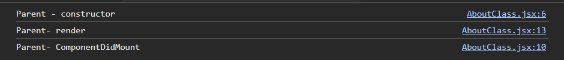
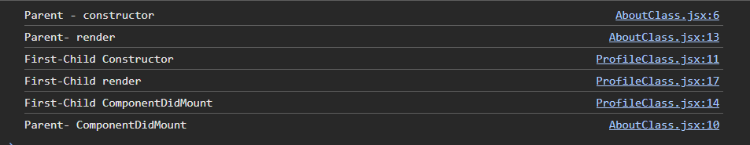
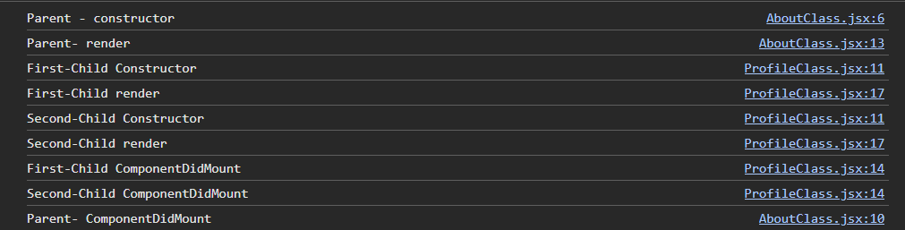
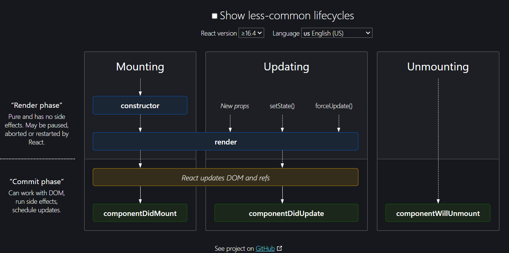

# 08. Let's Get Classy 🎩

- **Earlier Days of React** 🕰️:
  - React originally relied heavily on **class-based components**.
  - No `useState`, `useEffect`, or hooks—just classes and lifecycle methods.
  - Writing and maintaining code in class components was challenging, especially as applications grew in size.

- **Why Developers Loved It** 💻:
  - Despite the challenges, class-based components were a game-changer for developers moving from jQuery to React.
  - The concept of **reconciliation** (React's ability to efficiently update the DOM) was always a part of React, but it has seen performance optimizations over time.

- **Challenges with Class-Based Components** 😓:
  - As the codebase expanded, **maintainability** became an issue.
  - Code in class components tended to get **messy** and harder to understand over time.
  - **New developers** often found it difficult to grasp the concepts behind class-based components.

- **Understanding Class-Based Components** 🧠:
  - Class-based components share the same purpose as functional components but are more complex.
  - It's important to understand them, as **legacy codebases** in some companies may still rely on this structure.
  - They are still **relevant in interviews**, so it's good to be familiar with common questions around them.

**Note:** Class-based components are **not widely used** in modern React development, but knowledge of them can be valuable for working with older projects or answering interview questions.

## Let's Explore More 🌟

- **Functional Components** 🔧:
  - At the end of the day, functional components are just **regular JavaScript functions**.
  
- **Class-Based Components** 🏛️:
  - Similarly, class-based components are essentially **JavaScript classes** under the hood.
  
- **The `render()` Method** 🖼️:
  - The most important part of a class-based component is the `render()` method.
  - You **cannot create** a valid class-based component without a `render()` method.
  - Just like functional components return JSX, the `render()` method in class-based components also returns **JSX**.

- **Injecting into the DOM** 🛠️:
  - Whatever you return from a functional component or the `render()` method in a class-based component gets **injected into the DOM**.

### Example code of Class-based Component vs Function Component.
#### Class-based Component
```javascript
import React from 'react'
class ProfileClass extends React.Component{
    render(){
        return (
      <>
        <h1>Profile Class Test</h1>
        </>
        )
    }
}
export default ProfileClass
```
- We define a class-based component with the `class` keyword followed by the name of the `component`. 🏷️ This syntax allows us to create a new class that extends the base `Component` class provided by React.

- After this, we `extend` with `React.Component`, which is imported from the `React` library. 📦 The `extends` keyword signifies that our class will inherit all the properties and methods of `React.Component`, allowing us to build upon React’s core functionalities.

- By using the `extends` keyword, we inherit the superpowers of `React.Component`. ✨ This inheritance grants us access to lifecycle methods, state management, and other built-in features of React components.

- The `render()` method is the most important; whatever needs to be returned should be written inside it. 🔄 This method must return a React element (JSX) that represents the UI of the component. It is called automatically by React to update the UI when the component’s state or props change.

- `import` and `export` work the same way as in functional components. 📥📤 These keywords are used to bring in external code (modules) and make parts of your code available to other modules. This modular approach helps in organizing and maintaining code more efficiently.


#### Functional Component
```javascript
const Profile = ()=>{
    return <h1>Profile</h1>
}
export default Profile
```
- A `Functional Component` works the same way as a normal `JavaScript` function. 🧩 It is a simpler way to create components in React by just defining a function that returns JSX.

- It is the new concise and developer-friendly form of writing `React` components. 🌟 Functional components eliminate the boilerplate code required for class-based components, making them easier to read and maintain.

- In a `functional component`, we don't have the `render()` method, but we still use the word `render` often when describing the `lifecycle` of the component due to legacy habits. 🔄 This is because the concept of rendering is central to both class-based and functional components, even though functional components handle rendering implicitly through their return statements.

## Props in Class-Based Component

- In a functional component, we receive props directly and can access them using `props.nameOfProps` or by destructuring them directly. 🛠️ This makes it easy to handle and manipulate properties passed from a parent component.

- But in a class-based component, we receive props inside the component using `this.props.name`. 📦 This means you access props through the `this` context, which refers to the current instance of the class component.

- So, **how does a class-based component know that it has received props?** 🤔 React is constantly tracking our class component. When props are passed from a parent to a child component, React attaches these props to the class component automatically. This allows the class-based component to access and use the props as needed.

### Example of receiving props in class-based component
```javascript
import React from 'react'
class ProfileClass extends React.Component{
    render(){
        const {hello} = this.props // destructing (h3 tag)
        return (
      <>
        <h1>Profile Class Test</h1>
        <h2>{this.props.hello}</h2>
        <h3>{hello} </h3> 
       </>
       )

    }
}
export default ProfileClass
```

### Example of receiving props in functonal component
```javascript
const Profile = (props)=>{
    return <h1>Profile {props.hello}</h1>
}
export default Profile
```
- Destructured props example
```javascript
const Profile = ({hello})=>{
    return <h1>Profile {hello}</h1>
}
export default Profile
```
## State in Class-Based Component 🧩

- **State variables** are essential in React to manage the UI and keep everything in sync. Without state variables, React wouldn’t be able to track changes and update the UI accordingly. 🔄

- In a **functional component**, we use a hook called `useState()` to manage state. 🎣 This hook requires two values: the initial state and a setter function to update the state and the UI.

- In a **class-based component**, we manage state using the `constructor` method. 🏗️ The `constructor` is where we initialize the state object and bind methods. State is defined as an object within the `constructor`, and we use `this.setState()` to update it.

```javascript
import React from 'react'

class ProfileClass extends React.Component{
    constructor(props){ //constructor method
        super(props);
        //creating State
        this.state= { count : 0 , count2:0} // we can have multiple state
    }
    render(){
        const {hello} = this.props
        return (
      <>
        <h1>Profile Class Test</h1>
        <h2>{hello}</h2>
        <h2>Count: {this.state.count}</h2>
        <button>{this.setState({count:2})}Click Here<button>
      </button>
        )
    </>
    } 
}
```
## State in Class-Based Component 🧩

- Inside the `constructor` method, within the `this.state` object, we can declare any number of state variables. 🛠️ This is where we initialize our component’s state, setting up the initial values that will control the component’s behavior and appearance.

    ```javascript
    class MyComponent extends React.Component {
      constructor(props) {
        super(props); // Necessary to access 'this.props'
        this.state = {
          count: 0,
          message: 'Hello, World!'
        };
      }
    }
    ```
    In this example, `count` and `message` are state variables initialized in the `constructor`.

- We pass the `props` keyword inside the `constructor(props)` method and also inside the `super(props)` method. 🔗 This is crucial because `super(props)` initializes the `this` context and allows us to use `this.props` within the constructor.

    ```javascript
    constructor(props) {
      super(props);
      // Now we can access this.props inside the constructor
      console.log(this.props);
    }
    ```

    If we skip `super(props)`, React will throw an error, as it’s required to correctly inherit from `React.Component`.

- Every state variable in a class-based component is stored inside `this.state = { all the state variables }`. 🗃️ This object holds all the state variables, which can be updated later using `this.setState()`.

    ```javascript
    this.state = {
      count: 0,
      isVisible: true
    };
    ```

    Here, `count` and `isVisible` are part of the state, and their values can control different aspects of the component's rendering.

- We do not mutate state directly. ❌ Never do `this.state = something`. Instead, always use `this.setState()` to update the state. This ensures React is aware of the state change and can re-render the component as needed.

    ```javascript
    // Incorrect way (never do this):
    this.state.count = 1;

    // Correct way:
    this.setState({ count: 1 });
    ```

    Using `this.setState()` tells React to update the component's state and re-render it to reflect the changes in the UI.

- React doesn't care whether we use a `functional` component or a `class-based` component. 🔄 The process of `reconciliation`—where React updates the DOM to match the virtual DOM—happens the same way in both types of components. This means that React treats both component types equally when it comes to rendering and updating the UI.

- Although we use the `useState` hook to manage state in the newer functional component approach, behind the scenes, state is managed the same way as in class-based components. 🧠 This means that even though the syntax is different and more concise in functional components, the underlying mechanism of state management—where React tracks state changes and triggers re-renders—is consistent across both paradigms.

## React Lifecycle 🔄

The React component lifecycle consists of a series of methods that are invoked at different stages of a component’s existence. These stages include **mounting**, **updating**, and **unmounting**.

### 1. Mounting 🛠️
This phase occurs when a component is being inserted into the DOM for the first time. The following methods are invoked in this order:

- **`constructor()`**: This method is called when the component is first created. It’s where you typically initialize the component’s state and bind event handlers.

    ```javascript
    class MyComponent extends React.Component {
      constructor(props) {
        super(props);
        this.state = { count: 0 };
        console.log('Component is being created');
      }
    }
    ```


- **`render()`**: The `render` method is required in class-based components and is responsible for returning the JSX that represents the component's UI.

    ```javascript
    render() {
      return (
        <div>
          <p>Count: {this.state.count}</p>
        </div>
      );
    }
    ```

- **`componentDidMount()`**: This method is invoked immediately after the component is added to the DOM. It’s commonly used for making API calls or setting up subscriptions.

    ```javascript
    componentDidMount() {
      console.log('Component has been mounted');
      // Example: Fetching data or setting up a timer
    }
    ```

### Example to understand this LifeCycle Method 🔄
```javascript
import {Component} from "react";
import ProfileClass from "./ProfileClass";
class About extends Component{
    constructor(props){
        super(props);
        console.log("Parent - constructor")
    }
    componentDidMount(){
        // API Calls
        console.log("Parent- ComponentDidMount")
    }
    render(){
        console.log("Parent- render")
        return (
        <div>
            <h1>About</h1>
        </div>
    )
    }
}
export default About
```
Below is Output:-
- First constructor method is called
- Then render
- After render componentDidMount Called. Thats why this is best place to make an API call.



Now lets add a child component inside our `About.jsx`
```javascript
// AboutClass.jsx
import {Component} from "react";
import ProfileClass from "./ProfileClass";
class About extends Component{
    constructor(props){
        super(props);
        console.log("Parent - constructor")
    }
    componentDidMount(){
        // API Calls
        console.log("Parent- ComponentDidMount")
    }
    render(){
        console.log("Parent- render")
        return (
        <div>
            <h1>About</h1>
            <ProfileClass name="First-Child"/>
        </div>
    )
    }
}
export default About
```
```javascript
//ProfileClass.jsx
import React from 'react'

class ProfileClass extends React.Component{
    constructor(props){
        super(props);
        //creating State
        this.state= {
            count : 0,
            count2:1
        }
        console.log(`${this.props.name} Constructor`)
    }
    componentDidMount(){
        console.log(`${this.props.name} ComponentDidMount`)
    }
    render(){
        console.log(`${this.props.name} render`)
        const {name} = this.props
        return (
      <>
        <h1>Profile Class Test</h1>
        <h2>{name}</h2>
        <h2>Count: {this.state.count}</h2>
        <button onClick={()=>this.setState({count:2})}>Click Here</button>
      </>
        )
    }
}
export default ProfileClass
```
- **Now, what will be the output?** 🤔
  
- First, the parent component runs, and then its child as soon as React encounters it. This means the React lifecycle methods for the parent component will be invoked first until it reaches the child component.

- As soon as React encounters a `child component` within the parent, it temporarily `pauses` the parent’s lifecycle to fully process the child component's lifecycle methods. React ensures the child component is properly constructed, rendered, and mounted before resuming and completing the parent’s lifecycle.



- Here, as we can see, once React reaches the child component, it completes the child’s entire lifecycle before returning to the parent to complete its lifecycle methods. This order ensures that the child component is fully initialized and mounted before the parent component finishes mounting.

- But what happens if we have more than one child? 🤔 How does the lifecycle work in that case? Let’s explore that scenario.

```javascript
...
render(){
return (
        <div>
            <h1>About</h1>
            <ProfileClass name="First-Child"/>
            <ProfileClass name="Second-Child"/>
        </div>
    )
}
```


## React's Two Phases of Rendering ⚙️

- When React is rendering components, it does so in two distinct phases:
  - **Render Phase** 🖼️
  - **Commit Phase** ✅

### Render Phase 🖼️

- React first completes the **render phase**. During this phase, React prepares what needs to be rendered by calculating the changes that will be made to the UI. However, it does not actually make any changes to the DOM during this phase.

- When there are multiple child components (as in the example above), React processes the render phase in **batches**. This means it can evaluate all the components that need to be updated without actually making those changes visible in the browser just yet.

- The **render phase** is quick and efficient because React is only determining the changes, not applying them. This allows React to optimize performance and ensure everything is prepared correctly before moving to the next phase.

### Commit Phase ✅

- After completing the render phase, React then transitions to the **commit phase**. This is where the actual changes are made to the DOM, and side effects such as API calls are triggered.

- The reason the render phase is completed first is because it’s a lightweight and fast process. The commit phase, on the other hand, is more **expensive** because it involves updating the DOM and performing other potentially slow operations.

- If React were to move to the commit phase without completing the render phase, it might result in **inconsistencies** in the UI, as the DOM could be updated before React has fully determined what changes need to be made.

- By separating these two phases, React ensures that it can efficiently prepare and then accurately apply changes, leading to a smoother and more consistent user experience.

## Let's Make an API Call
```javascript
  
```