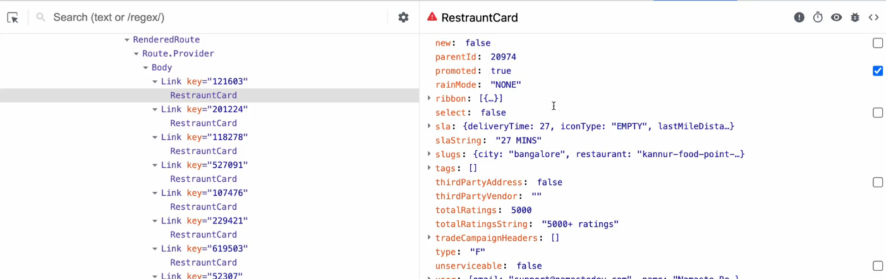

## Optimizing Data Management in React 🚀

- **ReactDevTools Insight**: Inside ReactDevTools, we can see the Data Layer, which means we can inspect API data directly without needing to `console.log` it. This makes debugging and analyzing your application's data much easier.
  

### Data Best Practices 💡

- **Don't Waste Your Data**: Be mindful of unnecessary data fetching or processing.
- **Structure Your Data Well**: Organize your data efficiently for easier access and manipulation.
- **Data is the New Oil**: Handle your data with care, as it’s a valuable resource in modern applications.
- **Use it Wisely**: Optimize data usage to enhance performance and user experience.

### UI Layer in React 🖼️

- **Definition**: Manages the presentation and user interface, handling how data is displayed and interacted with.
- **Components**: Built using React components that define the look and behavior of the UI.
- **Purpose**: Displays data meaningfully to the user and handles user interactions, passing events to the data layer.
- **Interaction**: Receives data as props or through context and sends user inputs back to the data layer.

### Data Layer in React 📊

- **Definition**: Manages state, data fetching, and business logic, dealing with data storage, retrieval, and processing.
- **State Management**: Uses hooks (`useState`, `useReducer`) or libraries (Redux, Zustand) to manage application state.
- **Data Fetching**: Handles API calls and other data sources, providing data to the UI layer.
- **Separation**: Keeps business logic separate from UI logic for better organization and maintainability.
- **Interaction**: Supplies data to the UI layer and updates state based on user actions or external events.

### Key Differences

- **Focus**: UI layer focuses on presentation, while the data layer focuses on data management.
- **Logic**: UI layer handles how data looks; data layer handles how data is fetched and managed.
- **Interaction**: UI layer displays data and sends user actions to the data layer for state updates.

## What are Props? 📦

- **Props**: Props are pieces of data that a parent component passes down to its child components. They allow components to communicate and share information in React.

## Difference Between Props and State Variables ⚖️

### Props:

- **Immutable**: Props are read-only and cannot be modified by the receiving component.
- **Parent-Child Relationship**: Passed from parent to child components.
- **Reusability**: Helps in making components reusable by allowing different data to be passed in.

### State:

- **Mutable**: State can be changed and managed within the component.
- **Component-Specific**: Maintained and controlled by the component itself.
- **Triggers Re-renders**: Changing state triggers re-renders of the component.

## Prop Drilling 🌀

### What is Prop Drilling?

- **Prop Drilling**: The process of passing data (props) through multiple layers of components, which can lead to several issues:
  - **Code Clutter**: Makes the codebase messy and hard to maintain.
  - **Performance Impact**: Changing props in a parent component causes all components that receive those props to re-render, potentially slowing down the application.
  - **State Lifting**: Sometimes requires lifting state up to a common ancestor, which can make the component tree more complex.

## Context API in React 🌐

### What is Context API?

- **Context API**: A React feature that allows you to share state and data across your component tree without prop drilling. It provides a way to pass data through the component tree without having to pass props down manually at every level.

### How to Use Context API?

1. **Create a Context**: Use `React.createContext()` to create a new context. Usually created in `utils`folder at centeral place.
   ```javascript
   const MyContext = React.createContext();
   ```
2. **Provider Component**: Wrap your component tree with the Provider component of the created context. This will pass the data to all components inside the provider.

```javascript
<MyContext.Provider value={/* some value */}>
  {/* children components */}
</MyContext.Provider>
```

3. **\*Consume the Context: Use** the useContext hook or MyContext.Consumer to access the context value in any component within the provider.

```javascript
const value = useContext(MyContext);
```

### Benefits of Context API 🌟

- **Avoids Prop Drilling**:
  - **Reduction in Prop Passing**: Context API significantly reduces the need to pass props through intermediate components, which can simplify your component structure and make the code less cluttered.
- **Centralized State Management**:

  - **Efficient State Sharing**: It allows you to manage and share state across large component trees from a single point, making it easier to handle global state changes and ensuring consistency across your application.

- **Improved Code Readability**:
  - **Cleaner Codebase**: By eliminating unnecessary prop chains, the Context API improves code readability, making your codebase more maintainable and easier to understand, especially as your application grows in complexity.

```javascript
import React, { createContext, useContext, useState } from "react";

// Create a context
const ThemeContext = createContext();

function App() {
  const [theme, setTheme] = useState("light");

  return (
    <ThemeContext.Provider value={{ theme, setTheme }}>
      <Toolbar />
    </ThemeContext.Provider>
  );
}

function Toolbar() {
  const { theme, setTheme } = useContext(ThemeContext);

  return (
    <div>
      <h1>Current Theme: {theme}</h1>
      <button onClick={() => setTheme(theme === "light" ? "dark" : "light")}>
        Toggle Theme
      </button>
    </div>
  );
}

export default App;
```
