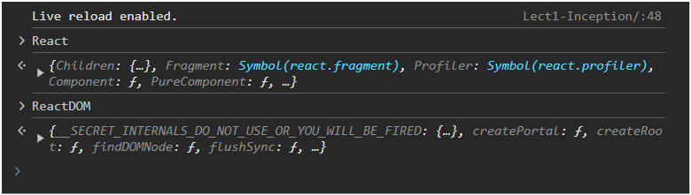

# 1. Inception

## Inception

- First, we started with normal HTML and then wrote `<h1>Namaste React</h1>` inside the root element.
- Then Akshay showed us how to do the same thing with JavaScript. Below is the code to add `<h1>Namaste React</h1>` inside the root element.

```javascript
<script>
  const root = document.getElementById("root"); const h1 =
  document.createElement("h1"); h1.textContent = "Namaste React";
  root.appendChild(h1);
</script>
```

- Very easy we all have worked with JS and we know **DOM Manipulation**.
- We know Browser provides us DOM API to directly interact with html elemnet and make our website dynamic.

## It's Time to add React to our code

But we aren't going to do `npm create react app` yet. Wait!

- In this lecture, we started with simple **React** and **React-DOM** using a CDN. This demonstrates what a library is all about—libraries are simple and lightweight.
- We can easily import them and start working with them.
- However, the same can't be done with frameworks. **Frameworks** impose certain rules and structures that we must follow.

### Key Points:

- **React** and **React-DOM** are libraries, which are typically more flexible and lightweight.
- **Frameworks** require adherence to specific conventions and provide a more structured environment.

To learn more about using React with a CDN, you can refer to the official [React CDN documentation](https://legacy.reactjs.org/docs/cdn-links.html).

Now add both the CDN links to the `index.html` file in the `<script>` tags at the end of the `<body>` tag to add React to your project.

```html
<body>
  <div id="root"></div>
  <!-- Add these scripts at the end of the body tag -->
  <script
    crossorigin
    src="https://unpkg.com/react@18/umd/react.development.js"
  ></script>
  <script
    crossorigin
    src="https://unpkg.com/react-dom@18/umd/react-dom.development.js"
  ></script>
</body>
```

As soon as we add these CDN links, we'll gain the superpower of React and ReactDOM.

We can check this by opening the browser console and typing `React` and `ReactDOM`. Below is what we should see:



Now we will write React Code to render `Namaste React` on our webpage.

Add the following script to your `index.html` file within the `<script>` tags, placed at the end of the `<body>` tag:

```html
<script>
  const heading = React.createElement("h1", {}, "Namaste React!!");
  const root = ReactDOM.createRoot(document.querySelector("#root"));
  root.render(heading);
</script>
```

Well React is very intiutive to understand but for reference gere is the explanation for each line of Code:-

1. Creating a React Element

`const heading = React.createElement("h1", {}, "Namaste React!!");`

- This line creates a React element representing an `<h1>` HTML tag with the text "Namaste React!!". The `React.createElement` function is used to create elements that will be rendered (added into the html DOM) by `React.render()` method.
- In `React.createElement()` method we have `{}` empty object. In this we can pass props. Like adding `id`, `class`, or `style` directly to the tag.

2. Selecting the Root Element

`const root = ReactDOM.createRoot(document.querySelector("#root"));`

- This line selects the DOM element with the ID root and prepares it as the root for React rendering.`ReactDOM.createRoot` initializes a React root that will manage the React tree.

3. Rendering the Element
   `root.render(heading);`

- This line renders the heading React element into the root element. The `root.render` function inject the heading Element into the DOM the `root` Element. It will override the root Element.

### Key Points:

- **React** Elements at the end of the day are **objects**. If we do `console.log(heading)` and `console.log(root)`. We will get Object in return.
- We can add **React** into our existing `html` project.
- So, suppose if we want to add react to `SearchBar` just make that element `root` and we can write react for that. (But this is not recommended).
- We generally have one `root` and we write everything React code inside that `root`. No matter how large the application is.

### Interesting Question from Akshay Saini

What will happen if we add lots of other elements inside the `root` element where React is rendering?

Consider the following HTML:

```html
<body>
  <div id="root">
    <h1 id="title">Hello World</h1>
    <h1 id="title">Hello World</h1>
    <h1 id="title">Hello World</h1>
  </div>
</body>
```

In this case, what will happen to the heading rendered by React? Will it appear before or after all the existing tags?

- Well react.render() method overwrites everythings inside the root.
- This React's approach ensures that the entire content of the root element is controlled by the content specified in the `ReactDOM.render()` call.

### Developer Community Practice

In the developer community, it is common to place the text `Not Rendered` inside the root element to help identify issues with React rendering.

Consider the following HTML:

```html
<body>
  <div id="root">Not Rendered</div>
</body>
```

- And if `Not rendered` is printed on web page that means there is some error with React rendering. And React is not able to modify the root.

- Since the `<script>` tags are placed at the end of the `<body>` tag, the browser first renders the HTML and displays `Not Rendered` before executing the React scripts.

- If everything is set up correctly, React will modify the contents of the root element after the page has loaded and the scripts have been executed.

- React core philosophy was to write everything in JS File leaving the html file as it is. But the older way with creating `React.createElement()` and then `ReactDOM.createRoot()` and so on was not suitable for big application.
- It was very verbose and compilcated to write this much code just for creating simple `h1` and `div` tag and the `rendering` it to html.

### So the JSX was built

- The introduction of JSX (JavaScript XML) in 2013 was a significant step forward in making React development more intuitive and readable.
- JSX allows developers to write HTML-like syntax directly within JavaScript files.
- Under the hood JSX files are translated into React native way of writing code and then that is again translated to the normal html,css, an js.
- Babel is the tool responsible for converting JSX code into native React code.
- It processes JSX syntax and transforms it into plain JavaScript that browsers can understand and execute.

## Here's a brief comparison of using `React.createElement()` versus JSX:

### Using React.createElement():

`const element = React.createElement('h1', null, 'Hello, world!');`

### Using JSX:

`const element = <h1>Hello, world!</h1>; `

- And JSX syntax is much more cleaner and easy to understand because of its html like structure.

Thanks to **JSX** for making our life easier.😎
